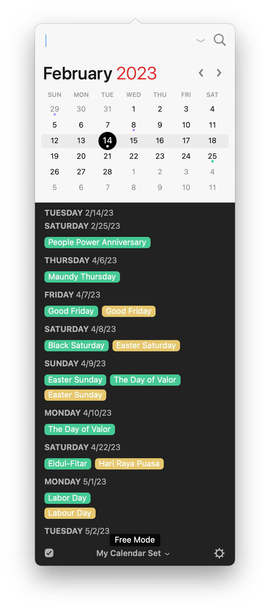
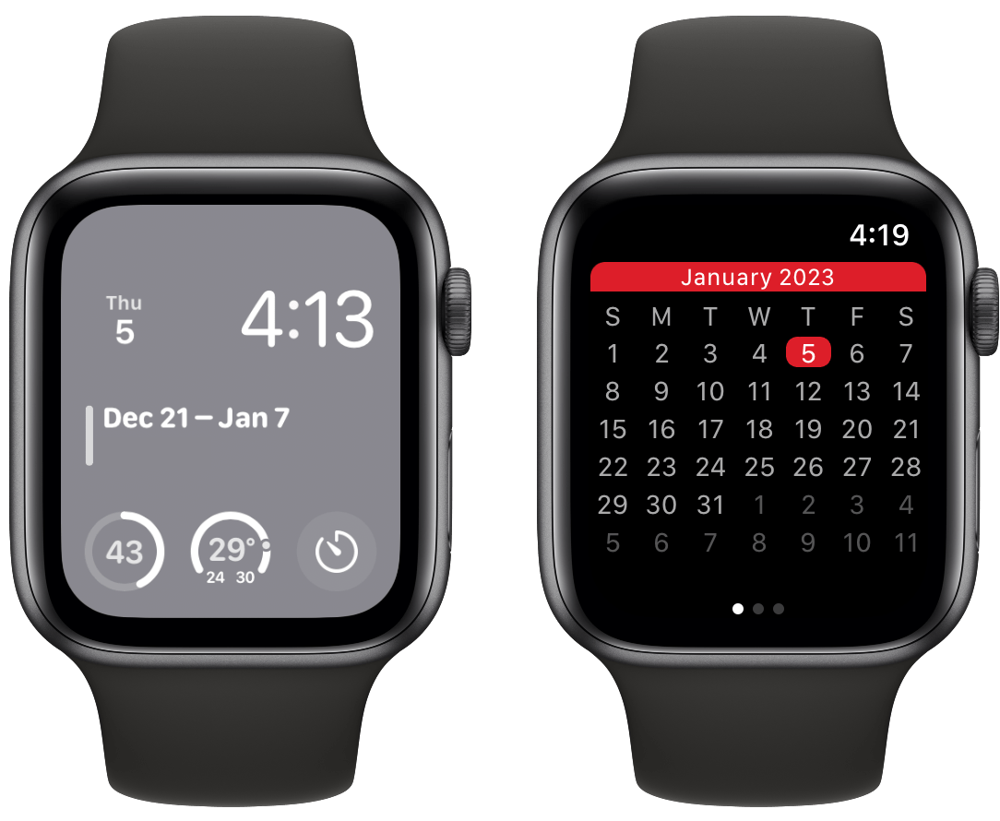
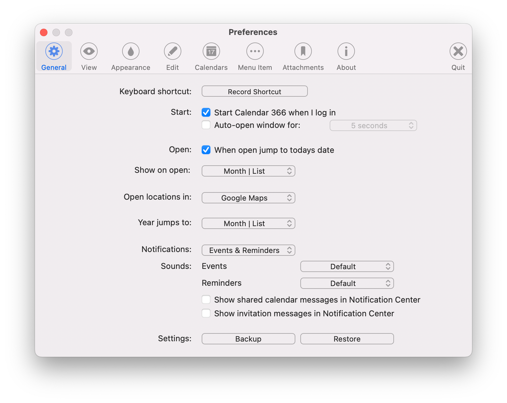
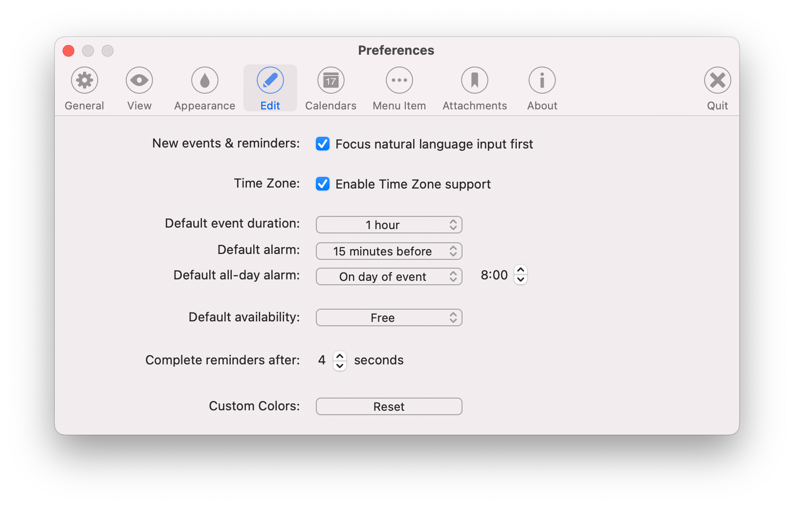

+++
date = 2023-01-05
title = "Calendars"
slug = "calendars"
categories = ["uses", "tools", "app", "blog"]
keywords = ["calendar", "productivity", "apps"]
summary = "Looking for a Fantastical alternative"
+++

I think it’s time to replace Fantastical with Calendar 366.

Right now, I'm using three calendars in total. [Fantastical](https://flexibits.com/fantastical) is my main, [Calendar 366](https://nspektor.com/) for my Apple Watch, and [Cron](https://cron.com/) for beta testing use. The default [Apple Calendar](https://www.icloud.com/calendar) app is meh for me. Lacks a lot of functionality and features for everyday use. I've been using Fantastical ever since. I REALLY love the menu bar feature. I've been adding events using the menu bar feature and it just works perfectly. I'm only able to open the full window when plotting schedules, and viewing previous and next months. I can do a lot of things with the free version on my Mac and iOS. The downside is the free version doesn't support Apple Watch. That's where Calendar 366 comes in. 

I'm lucky to be able to get the iOS Calendar 366 app for only [$1.99](https://www.reddit.com/r/AppHookup/comments/poc5tu/ioscalendar_366699_199/) (original price is $6.99, Mac has options to buy the app in their store or the App Store). Big thanks to the developer for the discount. I mainly use the app for my custom Apple Watch Watchface since it's the only app that can view the months and list view of events. 

In case you're wondering why I have double holidays shown. That's because I subscribe to Philippine Holidays and Singapore Holidays.

## My previous calendar workflow

I check my calendar before going to bed and it's also one of the first things I check in the morning once I'm settled at my work desk. Or on the weekends, when I wake up late, I just use my phone to check for the schedules. On my Mac, I have Fantastical and [Cron](https://cron.com/). I view my schedules on the Cron app because it's easy to navigate and it just syncs right away when you have changes on the calendar subscriptions. When scheduling, Fantastical's menu bar feature is my best friend — fast and reliable. Plus [Fantastical’s natural language engine](https://flexibits.com/fantastical/help/adding-events-and-tasks) makes it easy to capture things just by using sentences as you would normally speak. So when I type in the menu bar, "Manila trip on Tuesday at 7 am", it automatically distributes the texts I typed into their specific fields. You can type it in with quotation marks to put specific text in the event so it won't confuse the parser. 

On my iPhone, I use Fantastical for scheduling. Cron recently released their Cron iOS app in beta. And I have that installed too. But I don't use it because there's no Month + List view and it's still in beta, so I would not rely on it. But it syncs perfectly well with the Mac app. 

On my Apple Watch Watchface, I use Calendar 366 because it's the only calendar app that I use that can view my latest events and appointments. 

This workflow (Mac +iOS) has been going on for almost 4 years now and it honestly works well for me. Even with just using Fantastical's free tier. Fantastical also changed their viewing option on their free tier last February 2022 wherein you can view the month on the Mac desktop. Although I am not sure if it's the same for other users.

## Calendar 366

I find the Calendar 366 app a great alternative to Fantastical, or even other calendar apps out there. There's natural language input, a menu bar feature, and no need to create an account from them. Most importantly, it's a one-time payment. I would gladly pay for this app, especially since it's below the maximum amount I would buy. Two downsides: one, it's only a menu bar app - there's no stand-alone app that you can open to get a full view of the months, years, etc. You can, however, resize the menu bar window, but it was quite clunky when I tried it. Second, since it's an indie app, the settings' UI is quite outdated.

When selecting apps, I make sure my intentions are clear and straightforward. I make use of calendars for any events or important reminders that I may have, and I have a dedicated app for keeping track of all my to-dos. I like to ensure that the apps I select are user-friendly and easy to navigate, as this makes my life much simpler. Plus, I also make sure that the app has all the features I need in order to make the most out of it. I make sure that the app is compatible with all of my devices, so that I can access it from anywhere. By taking all of these factors into consideration, I am able to choose the most suitable apps for my needs. *Hopefully.*

## Conclusion

I'm going to follow my gut and take a chance by giving Calendar 366 a try for a period of about two weeks to a month. I want to see if this app can really work for me, and I'm confident that investing this amount of time will be worth it in the end. I'm sure the features and tools that the app has to offer will be beneficial and make my life easier in the long run. I don't need to use three apps at once just to keep track of my events and schedules. Plus, I'm looking forward to experiencing the convenience that it can provide, as well as discovering how it can make a real difference in my daily organization.

## April 2023 Update

I'm now using <u>Calendar 366</u> as my main calendar app for its menu bar feature. While it's not perfect and can sometimes be a bit clunky, it's a fantastic alternative to the more expensive Fantastical. Additionally, I also use <u>Cron</u> as a sort of calendar desk view because their sync function is smooth. Cron is an excellent calendar app that works seamlessly with Google Calendar. It offers a range of add-on features that make scheduling and organization effortless. Very useful if you have multiple Google Cal accounts and need a simple solution to work between several calendars. 

